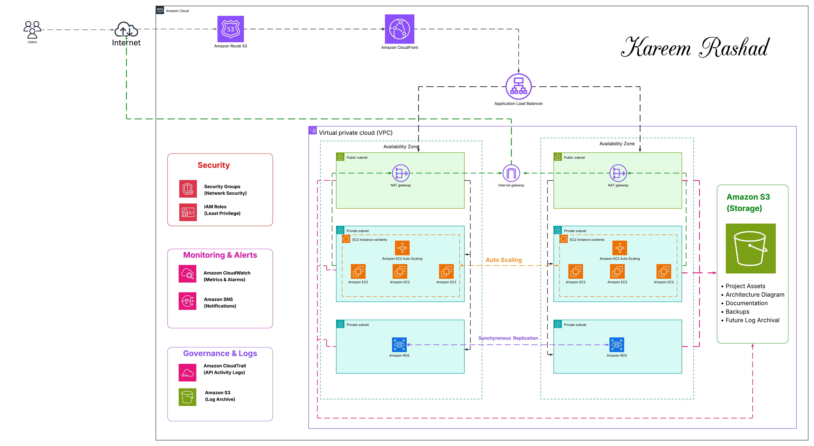

# AWS Production-Ready Highly Available Web Application

## Project Overview

This project demonstrates the design and deployment of a production-ready, highly available, scalable, and secure web application on Amazon Web Services (AWS).

The architecture follows the AWS Well-Architected Framework principles, focusing on high availability, fault tolerance, security, operational excellence, and scalability.

The infrastructure is deployed across multiple Availability Zones using Amazon EC2 instances managed by an Auto Scaling Group behind an Application Load Balancer. The application is secured using AWS WAF, Security Groups, IAM Roles, and private networking. Monitoring and alerting are implemented using Amazon CloudWatch and Amazon SNS.

---

## Architecture Diagram



# Solution Architecture

The application is deployed inside a custom Amazon VPC spanning two Availability Zones to ensure high availability and resilience.

The architecture consists of:

- Users access the application through an Application Load Balancer.
- The Load Balancer distributes incoming traffic across multiple EC2 instances.
- EC2 instances are deployed in private application subnets.
- Auto Scaling automatically adjusts the number of EC2 instances based on workload.
- Amazon RDS MySQL provides a highly available managed database.
- Amazon S3 stores project assets, documentation, architecture diagrams, and backups.
- AWS WAF protects the application against common web attacks.
- Amazon CloudWatch continuously monitors infrastructure health.
- Amazon SNS sends email notifications whenever CloudWatch alarms are triggered.

---

# AWS Services Used

## Networking

- Amazon VPC
- Public Subnets
- Private Application Subnets
- Private Database Subnets
- Internet Gateway
- NAT Gateway
- Route Tables

---

## Compute

- Amazon EC2
- Launch Template
- Auto Scaling Group

---

## Load Balancing

- Application Load Balancer
- Target Groups
- Health Checks

---

## Database

- Amazon RDS MySQL
- Multi-AZ Deployment

---

## Storage

- Amazon S3

---

## Security

- AWS WAF
- Security Groups
- IAM Roles
- Systems Manager Session Manager

---

## Monitoring

- Amazon CloudWatch
- Amazon SNS

---

# VPC Design

## VPC

CIDR Block

```
10.0.0.0/16
```

---

## Public Subnets

| Subnet | CIDR | Availability Zone |
|---------|------|-------------------|
| Public Subnet A | 10.0.1.0/24 | AZ-A |
| Public Subnet B | 10.0.2.0/24 | AZ-B |

Used for:

- Application Load Balancer
- NAT Gateway

---

## Private Application Subnets

| Subnet | CIDR | Availability Zone |
|---------|------|-------------------|
| Private-App-A | 10.0.11.0/24 | AZ-A |
| Private-App-B | 10.0.12.0/24 | AZ-B |

Used for:

- Amazon EC2 Instances

---

## Private Database Subnets

| Subnet | CIDR | Availability Zone |
|---------|------|-------------------|
| Private-DB-A | 10.0.21.0/24 | AZ-A |
| Private-DB-B | 10.0.22.0/24 | AZ-B |

Used for:

- Amazon RDS

---

# Security Groups

## Application Load Balancer Security Group

### Inbound Rules

| Protocol | Port | Source |
|----------|------|---------|
| HTTP | 80 | 0.0.0.0/0 |
| HTTPS | 443 | 0.0.0.0/0 |

### Outbound Rules

- All Traffic

---

## EC2 Security Group

### Inbound Rules

| Protocol | Port | Source |
|----------|------|---------|
| HTTP | 80 | ALB Security Group |

### Outbound Rules

- All Traffic

---

## RDS Security Group

### Inbound Rules

| Protocol | Port | Source |
|----------|------|---------|
| MySQL | 3306 | EC2 Security Group |

### Outbound Rules

- All Traffic

---

# Auto Scaling Configuration

| Setting | Value |
|----------|-------|
| Minimum Capacity | 2 |
| Desired Capacity | 2 |
| Maximum Capacity | 4 |
| Scaling Metric | CPUUtilization |
| Scale-Out | CPU > 70% |
| Scale-In | CPU < 30% |

---

# Application Load Balancer

### Features

- Multi-AZ Deployment
- Health Checks
- Intelligent Traffic Distribution
- High Availability
- Fault Tolerance

### Health Check

| Property | Value |
|----------|-------|
| Protocol | HTTP |
| Port | 80 |
| Path | / |

---

# Amazon RDS

| Property | Value |
|----------|-------|
| Database Engine | MySQL |
| Deployment | Multi-AZ |
| Database Subnets | Private-DB-A & Private-DB-B |
| Public Access | Disabled |
| Accessibility | Private |

### Features

- Multi-AZ High Availability
- Automatic Failover
- Managed Backups
- Private Network Access

---

# Amazon S3

Used for:

- Architecture Diagram
- Project Documentation
- Screenshots
- Project Assets
- Backups
- Future Log Archival

### Enabled Features

- Versioning
- Server-Side Encryption

---

# AWS WAF Configuration

Enabled Managed Rule Groups:

## Core Rule Set

Provides protection against:

- Cross-Site Scripting (XSS)
- Common Web Exploits
- OWASP Top 10 Threats

---

## Known Bad Inputs

Blocks:

- Malicious Requests
- Suspicious Payloads

---

## SQL Database Protection

Protects against:

- SQL Injection Attacks

---

## Amazon IP Reputation List

Blocks:

- Known Malicious IP Addresses

---

# Monitoring & Alerting

Amazon CloudWatch monitors:

- EC2 CPU Utilization
- Auto Scaling Activities
- Load Balancer Metrics
- System Performance

### Alarm

High CPU Utilization

### Notification Service

Amazon SNS

Email notifications are automatically sent whenever alarms are triggered.

---

# High Availability Features

- Multi-AZ Deployment
- Application Load Balancer
- Auto Scaling Group
- Amazon RDS Multi-AZ
- Automatic Database Failover
- Health Checks
- Self-Healing Infrastructure
- Redundant NAT Gateway

---

# Security Features

- AWS WAF
- Security Groups
- IAM Roles
- Private Application Subnets
- Private Database Subnets
- Systems Manager Session Manager
- Amazon S3 Encryption
- Amazon RDS Private Access

---

# Testing Performed

## Application Load Balancer

- Verified successful access using ALB DNS Name.

---

## Auto Scaling

- Verified automatic scaling based on CPU utilization.

---

## Health Checks

- Verified healthy EC2 targets in the Target Group.

---

## AWS WAF

- Verified protection against malicious traffic and common web attacks.

---

## Amazon RDS

- Verified Multi-AZ deployment.
- Verified database availability.
- Verified private connectivity from EC2 instances.

---

## Application Connectivity

- Verified successful communication between EC2 instances and Amazon RDS MySQL.

---

# Learning Outcomes

Through this project, I learned how to:

- Design a production-ready AWS architecture.
- Build highly available applications.
- Configure Amazon VPC networking.
- Deploy highly available EC2 infrastructure.
- Configure Auto Scaling Groups.
- Deploy Application Load Balancers.
- Secure applications using AWS WAF.
- Configure secure Amazon RDS deployments.
- Monitor AWS resources using Amazon CloudWatch.
- Implement SNS notifications.
- Apply AWS Well-Architected Framework best practices.

---

# Future Enhancements

Potential future improvements include:

- Amazon Route 53
- Amazon CloudFront
- AWS Certificate Manager (ACM)
- CloudWatch Logs Export to Amazon S3
- AWS CloudFormation
- Terraform
- AWS CodePipeline
- AWS CodeDeploy
- AWS Systems Manager Patch Manager

---

# Project Structure

```
Project/
│
├── Architecture-Diagram.png
├── README.md
├── Screenshots/
├── Documentation/
└── Assets/
```

---

# Project Author

## Kareem Ahmed Rashad

Cloud & DevOps Engineer

AWS Production-Ready Highly Available Web Application

Built following AWS Well-Architected Framework best practices.
